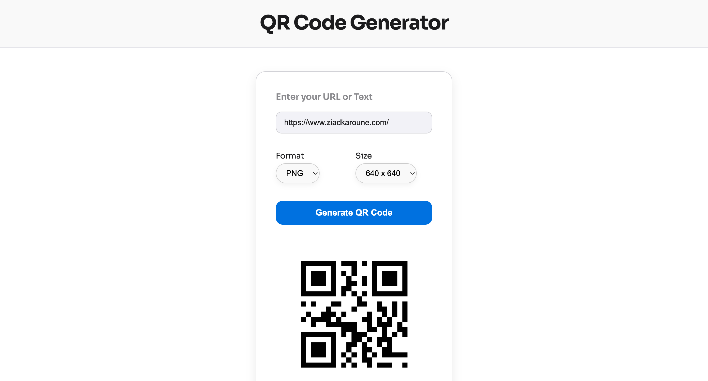

# 🔳 QR Code Generator (React + Node.js)

A full-stack QR Code generator application built with **React.js** on the frontend and **Express.js** on the backend. Generate QR codes in `png` or `svg` format, with customizable sizes, and download them directly.


---

## Features

-  Input any URL or text to encode
-  Choose image **format**: `png` or `svg`
- Set image **size** 
- Instantly render the QR code
-  Download the generated image
- Use via **frontend UI** or **terminal (curl)**

---

##  Getting Started

### 1. Clone the repository

```bash
git clone https://github.com/your-username/qr-code-generator.git
cd qr-code-generator
```
- Backend Setup
```bash
cd backendApi
npm install
node server.js
```
- the backend will start at:
    http://localhost:3000 (you can change the port)

- API Endpoint: POST
```bash
{
  "text": "https://example.com",
  "size": 800,
  "format": "png"
}
```
- Curl usage:
```bash
curl -X POST http://localhost:3000/generate \
  -H "Content-Type: application/json" \
  -d '{"text":"https://example.com", "size":600, "format":"svg"}'
```
- Frontend Setup
```bash
cd ../frontend
npm install
npm run dev
```
- The frontend will start at: http://localhost:5173 (depends on yout vite port config)
---
### 2. Usage

-    Open the app in your browser: http://localhost:5173

-   Enter your URL or text

-   Select desired format (png or svg)

-   Choose size from the dropdown

-   Click Generate QR Code

-   View and click Download to save the image

